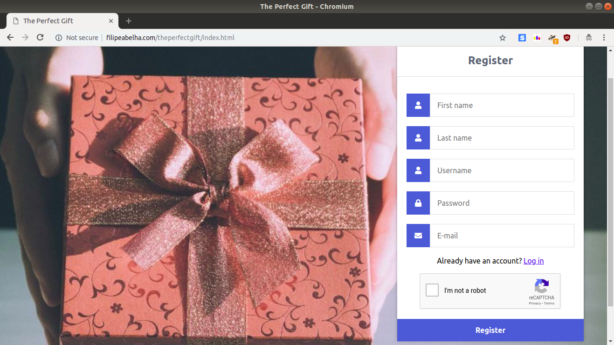
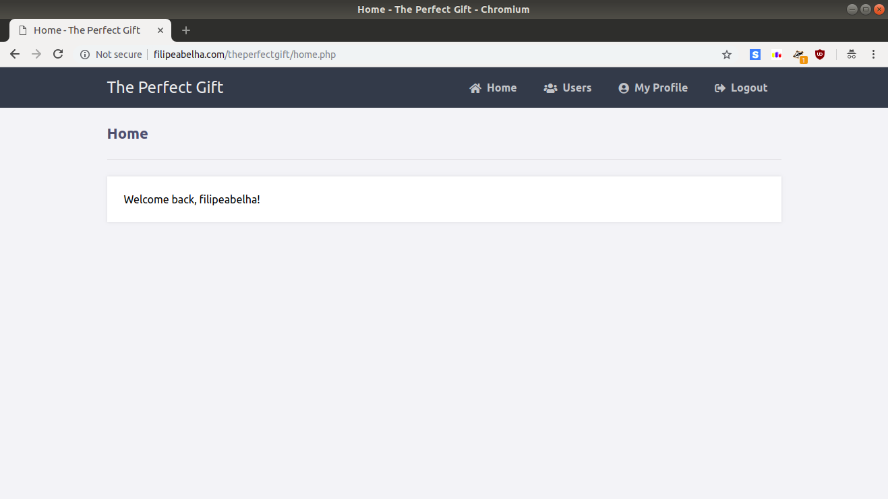
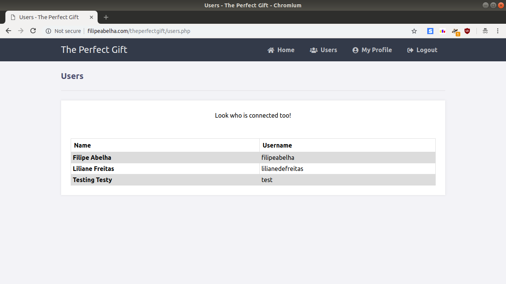
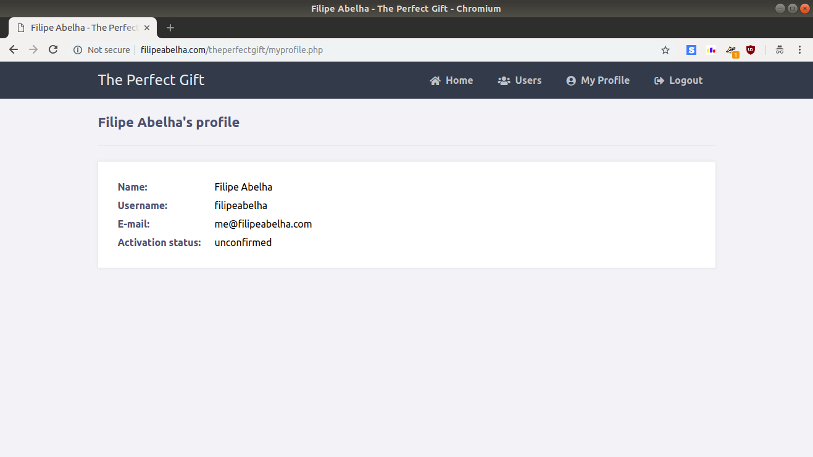
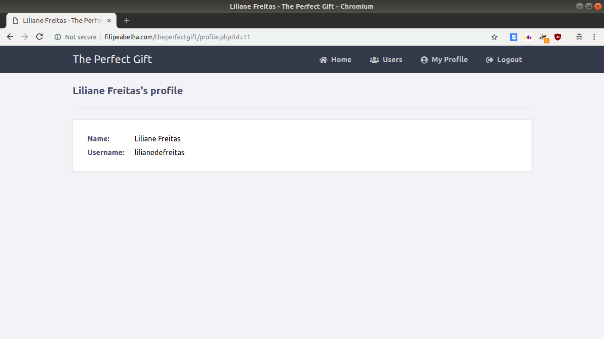

# The Perfect Gift

Do you want to impress a dear person with a special gift and have no idea of what to buy? If he/she is registered on The Perfect Gift, see a list of items he/she wants to earn! Otherwise, no problem - answer some questions and find the right gift, without a headache!

This project is about a gift list social network for people to publish a list of items he wants to earn, and if the user does not find the desired person, he can see some suggestions based on questions about the person's profile.

The project will be implemented using HTML/CSS, PHP and MySQL.

  
Figure 1: Register page

  
Figure 2: Home page

  
Figure 3: Users page

  
Figure 4: Profile page

  
Figure 5: Profile of other people

