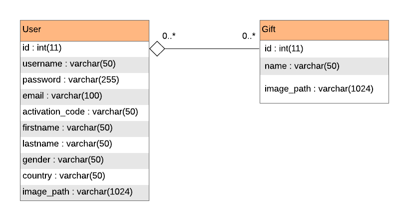

# The Perfect Gift

Do you want to impress a dear person with a special gift and have no idea of what to buy? If he/she is registered on The Perfect Gift, see a list of items he/she wants to earn! Otherwise, no problem - answer some questions and find the right gift, without a headache!

This project is about a gift list social network for people to publish a list of items he wants to earn, and if the user does not find the desired person, he can see some suggestions based on questions about the person's profile.

It uses HTML/CSS, PHP and MySQL.

Feel free to <a href="http://www.filipeabelha.com/theperfectgift">visit the project's homepage</a>!

## To-Do List

- [x] Basic code documentation
- [x] Create an Entity Relationship Diagram (ERD)

## Next core features

- [ ] User ability to create a list of preferred gifts 
- [ ] Get gift suggestions for an unregistered or not found user

## Next UX features

- [ ] Change PHP die() statements to improve UX
- [ ] Ability to edit profile
- [ ] Ability to reset password
- [ ] Ability to delete/deactivate account
- [ ] PT-BR version
- [ ] Mobile version

## Next bugfixes

- [ ] Activation e-mails not being sent

## Entity Relationship Diagram (ERD)

## Screenshots

### Register page

### Home page

### Users page

### Profile page

### Other people's profile

## License
This project is licensed under the GNU GPLv3 License - see the [LICENSE.md](LICENSE.md) file for details.
